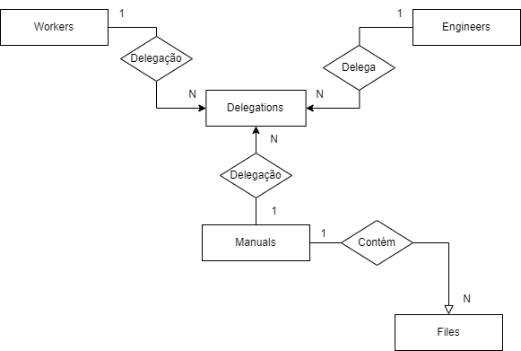
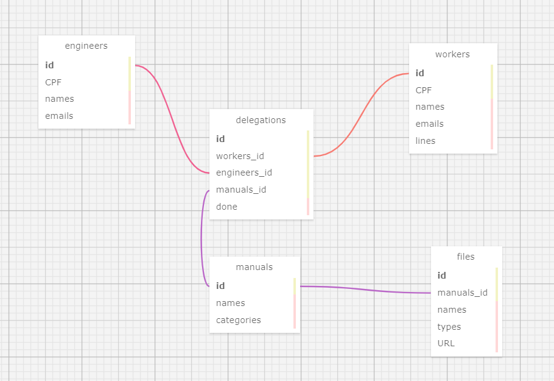

# Ponderada - Modelagem de Banco de Dados
Autor: Lucas Nepomuceno dos Santos  
Ateliê: 13  
Instituição: Inteli - Instituto de Tecnologia e Liderança

## Descrição do Projeto

&nbsp;&nbsp;&nbsp;&nbsp; Este banco de dados foi criado voltado ao projeto da lLedTech para a Dell Technologies: DellAware. O DellAware é um webapp que será integrado aos servidores da Dell e deve permitir que engenheiros da fábrica deleguem manuais aos montadores das linhas. Atualmente, na falta dessa solução, todo momento em que um manual é atualizado, o engenheiro responsável pela operação deve chamar a equipe trabalhando na linha que usa o manual atualizado para retreiná-los. Consequentemente, perde-se tempo e dinheiro. O projeto da lLedTech é permitir uma plataforma de delegação que promova o treinamento remoto, mais eficaz. 

## Banco de Dados
### 1. Modelo Conceitual

&nbsp;&nbsp;&nbsp;&nbsp; No contexto desse projeto, visando cumprir os seguintes requisitos:
- Engenheiros devem ser cadastrados no sistema;
- Montadores devem ser cadastrados no sistema;
- Manuais devem ser cadastrados no sistema;
- Manuais são conjuntos de arquivos que devem ser cadastrados no sistema;
- Um engenheiro deve ser capaz de delegar um manual a um montador

&nbsp;&nbsp;&nbsp;&nbsp; Elaborou-se o seguinte modelo conceitual de banco de dados:

Figura 1 - Modelo conceitual  
  

Material produzido pelos autores (2024)

&nbsp;&nbsp;&nbsp;&nbsp; Esse modelo apresenta 3 tabelas independentes: <code> engineers </code>, <code> workers </code> e <code> manuals </code>. Uma tabela dependente <code> files </code> e uma tabela por associação <code> delegations </code>. Em relação às tabelas com chaves estrangeiras, espera-se que <code> enginners </code> tenha o relacionamento de delegar com <code> delegations </code> e <code>workers</code> e <code>manuals</code> tenham a relação de delegação com a mesma. Além disso, espera-se que
<code> manuals </code> contenham <code> files </code>, ou seja, cada file tenha uma correspondência em um manual.

### 2. Modelo Lógico

&nbsp;&nbsp;&nbsp;&nbsp; A partir do modelo conceitual elaborado acima foi possível idealizar as tabelas principais do banco de dados. Então, fora preciso levantar os atributos de cada relação, os quais seguem os seguintes requisitos minímos:
- Tanto engenheiros quanto montadores devem ter cadastrados no sistema: CPF, nome e email;
- Montadores devem ter cadastrados a sua linha de trabalho;
- Manuais devem ter cadastrados: nome e, no mínimo, sua categoria;
- Os arquivos devem referenciar um manual e devem ter nome, tipo e URL especificados.

&nbsp;&nbsp;&nbsp;&nbsp; Abaixo, apresenta-se o modelo físico elaborado a partir desses requisitos com a ferramenta wwwsqldesigner

Figura 2 - Modelo Lógico  
  

Material produzido pelos autores (2024)

&nbsp;&nbsp;&nbsp;&nbsp; Evidencia-se, a partir da imagem acima, os atributos esperados para cada uma das relações criadas no banco de dados. Vê-se como os relacionamentos entre as relações fora feito por meio de chaves estrangeiras como <code> workers_id </code> e <code> engineers_id </code>. Além disso, vê-se como o modelo segue à risca a modelagem conceitual elaborada e os requisitos apresentados anteriormente nessa seção, permitindo o cadastramento de engenheiros, montadores, arquivos e manuais da maneira esperada, além da funcionalidade principal do sistema: as delegações.

### 3. Modelo Físico

&nbsp;&nbsp;&nbsp;&nbsp; O modelo físico desse banco de dados fora concebido a partir da linguagem postgreSQL. Ele foi testado dentro do SDG DBeaver que alterou os dados do banco de dados criado no Render. Esse, pode ser acessado a partir do arquivo .sql deste repositório: <a href="ponderadaGodoi.sql">ponderadaGodoi.sql</a>
